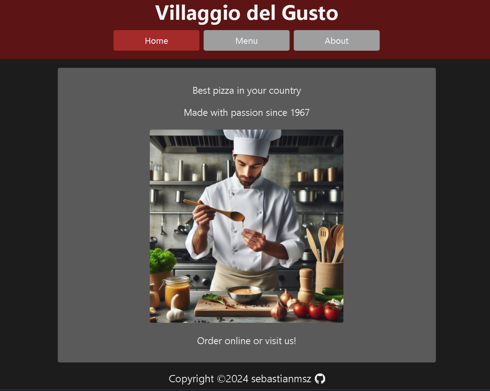

# Restaurant Page 🍕| Webpack and ES6 modules practice project 
This is a simple website for a fictional pizza restaurant called 'Villagio Del Gusto.' You can navigate through the home, menu, and about pages. This page is developed using ES6 modules and Webpack to bundle them. 

The main purpose of creating this project is to practice the workflow of modern web development, which involves utilizing ES6 modules for modular code organization and using Webpack as a module bundler to efficiently manage dependencies and optimize the website's performance.

## Screenshot


## Getting Started

### Installation

1. Clone the repository to your local machine:

   ```bash
   git clone https://github.com/sebastianmsz/restaurant-page.git
   ```

2. Open the project folder in your preferred code editor.

3. Launch the `index.html` file in a web browser to view the page.

### Live Demo
Experience the project live by visiting the [Restaurant Page](https://sebastianmsz.github.io/restaurant-page).

## Technologies Used

- HTML5
- CSS3
- JavaScript
- Git
- Webpack

## Contributions
If you're have ideas to enhance this project, contributions are highly encouraged. Open an issue or submit a pull request to share your insights.

## Contact
If you have questions, suggestions, or just want to discuss about pizza, feel free to reach out via email at sebastian.msz@proton.me.

Happy happy coding! 🛸